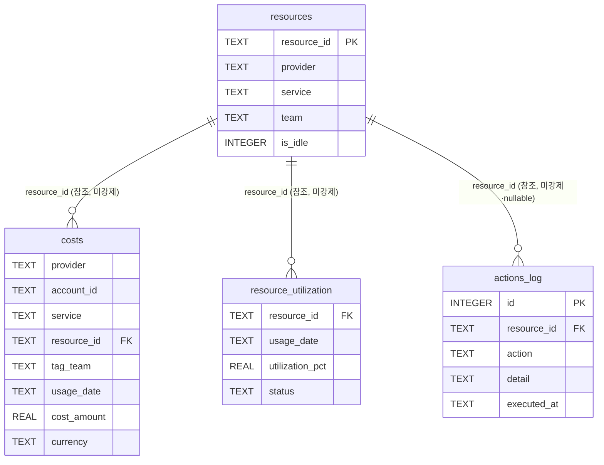
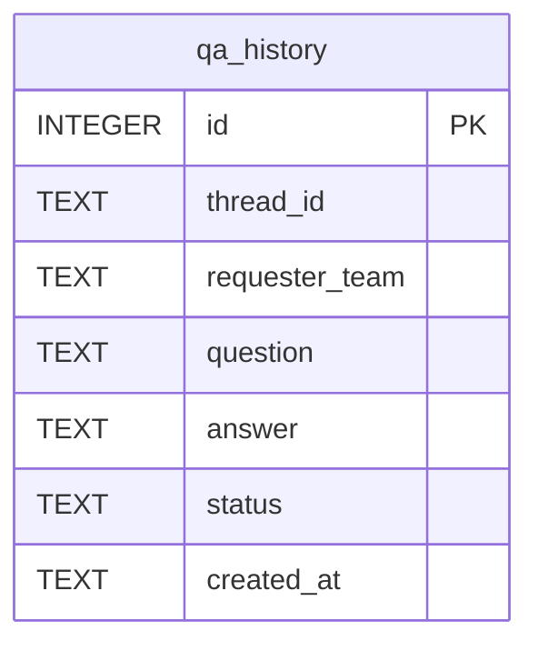
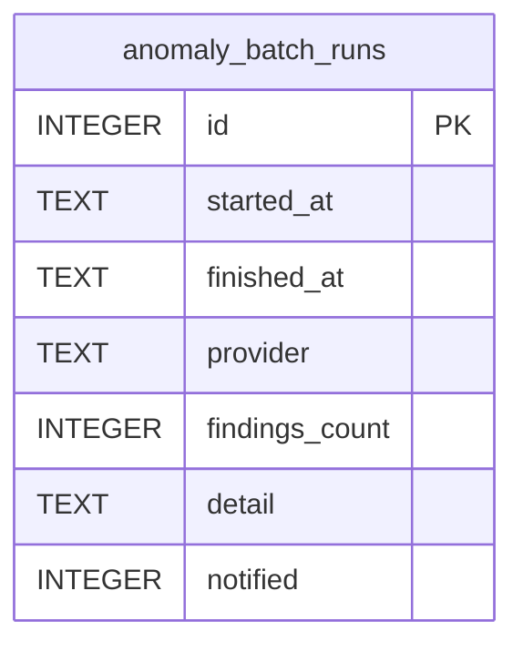
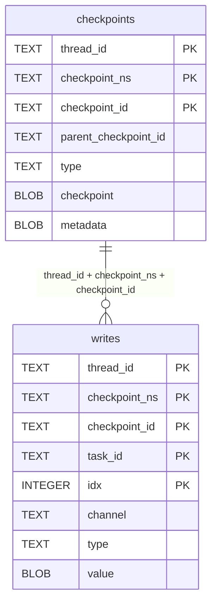
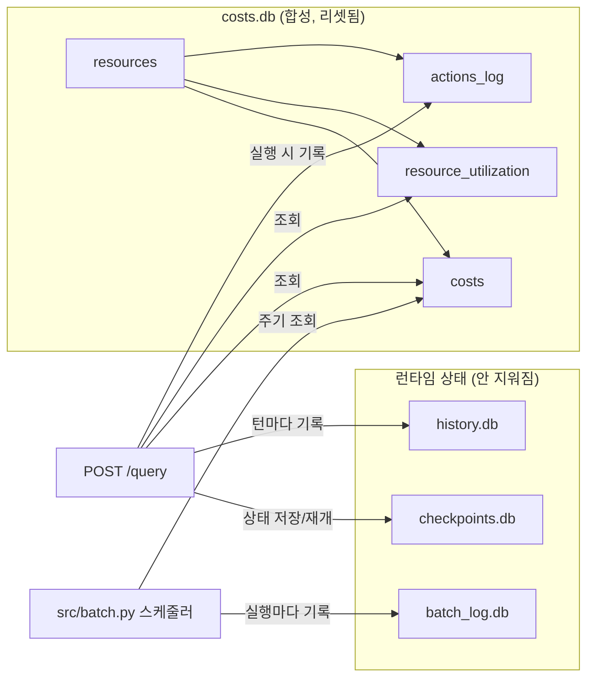

# ERD · 데이터베이스 구조

이 프로젝트는 성격이 다른 데이터를 하나의 DB에 몰지 않고 **SQLite 파일 4개**로 분리한다
(이유는 각 절 참고 — 대부분 "리셋 주기가 다르다"는 한 가지 원칙에서 나온다). 전부 SQLite라
파일 간 `FOREIGN KEY` 제약은 원천적으로 걸 수 없고, 같은 파일 안에서도 이 프로젝트는
FK 제약을 선언하지 않는다(성능·데모 단순화 목적) — 그래서 아래 관계는 전부
**"실제 DB가 강제하지는 않지만 코드가 지키는" 논리적 관계**다.

| 파일 | 관리 코드 | 리셋 시점 |
|---|---|---|
| `data/costs.db` | `scripts/generate_data.py` | **스크립트 재실행마다 통째로 삭제 후 재생성** (합성 데이터) |
| `data/history.db` | `src/qa_history.py` | 안 지워짐 (실제 대화 이력이 계속 누적) |
| `data/batch_log.db` | `src/batch.py` | 안 지워짐 (배치 실행 이력이 계속 누적) |
| `data/checkpoints.db` | `langgraph-checkpoint-sqlite` (외부 라이브러리) | 안 지워짐 (HITL 재개용 그래프 상태) |

---

## 1. `data/costs.db` — 합성 비용·리소스 데이터 (핵심 도메인 데이터)

`resources`가 리소스 마스터고, 나머지 3개 테이블이 전부 `resource_id`로 그 마스터를
참조한다(문자열 일치 기준, DB 레벨 FK 없음).

### `resources` — 리소스 마스터
정적 목록(코드에 하드코딩, `scripts/generate_data.py`의 `RESOURCES`), provider당 3~4개.

| 컬럼 | 타입 | 설명 |
|---|---|---|
| `resource_id` | TEXT (PK) | 예: `i-1001-ec2-team-a`. 이름 자체에 provider·서비스·team이 관례적으로 들어있지만 이건 **표기 관례일 뿐 파싱 근거로 쓰면 안 된다** — 실제 소속 판정은 항상 `team`/`tag_team` 컬럼으로 한다 |
| `provider` | TEXT | `aws` \| `gcp` \| `azure` |
| `service` | TEXT | 예: `EC2`, `BigQuery`, `SQL Database` |
| `team` | TEXT | 소유 팀 (`authz.py`가 `stop_resource`/`resize_resource`/`get_resource_utilization` 권한 검사에 사용) |
| `is_idle` | INTEGER (0/1) | `list_idle_resources` 판정 정답값 (합성 데이터라 사전에 정해둠) |

### `costs` — 일별 비용 (핵심 시계열, `detect_cost_anomaly`/`get_cost_by_service`/`get_budget_status`가 전부 이 테이블만 조회)

| 컬럼 | 타입 | 설명 |
|---|---|---|
| `provider` | TEXT | `aws` \| `gcp` \| `azure` |
| `account_id` | TEXT | 예: `aws-account-01`. **리소스 하나당 값 하나로 고정**(실측 확인: `GROUP BY resource_id HAVING COUNT(DISTINCT account_id) > 1` = 0건) — 같은 provider 안에서도 여러 계정을 구분하는 용도 |
| `service` | TEXT | `resources.service`와 동일 값이 중복 저장됨(정규화 안 됨 — 합성 데이터 생성 스크립트가 리소스 속성을 매일 그대로 복사) |
| `resource_id` | TEXT (논리 FK) | `resources.resource_id` 참조 |
| `tag_team` | TEXT | `resources.team`과 같은 값이 매일 복사됨(정규화 안 됨). authz 조회 필터는 이 컬럼 기준 |
| `usage_date` | TEXT (ISO `YYYY-MM-DD`) | 90일치, `DATA_END_DATE=2026-09-14` 기준 역산 |
| `cost_amount` | REAL | USD 기준 일별 비용 |
| `currency` | TEXT | **현재 전량 `'USD'` 고정**(실측 확인: `SELECT DISTINCT currency` = 1행) — 스키마상 통화 컬럼은 있지만 다중 통화 데이터는 아직 없음 |

- **PK 없음, 인덱스 없음** — `resource_id`/`usage_date`로 매번 풀스캔한다(합성 데이터 규모라 체감 안 되지만, 100만 건 이상으로 커지면 `(resource_id, usage_date)` 복합 인덱스가 필요해지는 지점 — 인덱스·파티션·엔진 교체까지 포함한 확장 방향은 [LIMITATIONS.md](LIMITATIONS.md) §4 참고).

### `resource_utilization` — 일별 사용률 (`get_resource_utilization`/`estimate_savings(downsizing)`가 조회)

| 컬럼 | 타입 | 설명 |
|---|---|---|
| `resource_id` | TEXT (논리 FK) | `resources.resource_id` 참조 |
| `usage_date` | TEXT (ISO) | `costs`와 같은 90일 구간 |
| `utilization_pct` | REAL | idle 리소스는 0~3%, 아니면 30~80% 사이 합성값 |
| `status` | TEXT | `idle` \| `running` |

### `actions_log` — 실행 이력 (`stop_resource`/`resize_resource`/`send_cost_alert`가 기록)

| 컬럼 | 타입 | 설명 |
|---|---|---|
| `id` | INTEGER (PK, AUTOINCREMENT) | |
| `resource_id` | TEXT (논리 FK, **nullable**) | `send_cost_alert`는 특정 리소스 대상이 아니라서 `NULL`로 기록됨 |
| `action` | TEXT | `stop` \| `resize` \| `alert` |
| `detail` | TEXT | 자유 형식 텍스트(LLM이 채운 인자 — `guardrails.mask_pii_deep`이 HITL 승인 응답 단계에서 마스킹) |
| `executed_at` | TEXT (ISO datetime) | 실행 시각 |

---

## 2. `data/history.db` — 질문·답변 이력 (`src/qa_history.py`)

| 컬럼 | 설명 |
|---|---|
| `id` | PK, AUTOINCREMENT |
| `thread_id` | `POST /query`의 대화 스레드 — **`checkpoints.db`의 `thread_id`와 값은 같지만 물리적으로 다른 SQLite 파일이라 FK로 못 묶는다**(애플리케이션 레벨 상관관계) |
| `requester_team` | 요청 시점 자기신고 팀 (인증 아님, `authz.py` 참고) |
| `question` / `answer` | 원문 |
| `status` | `answered` \| `pending_approval` \| `blocked` |
| `created_at` | ISO datetime (UTC, timezone-aware) |

`costs.db`가 스크립트 재실행마다 리셋되는 것과 달리 이 파일은 절대 안 지워진다 — 합성
데이터가 아니라 실제 사용 기록이기 때문(`qa_history.py` 모듈 docstring 참고).

---

## 3. `data/batch_log.db` — 이상탐지 배치 실행 이력 (`src/batch.py`)

| 컬럼 | 설명 |
|---|---|
| `id` | PK, AUTOINCREMENT |
| `started_at` / `finished_at` | 실행 구간 (ISO datetime, UTC) |
| `provider` | `aws` \| `gcp` \| `azure` — provider별로 행이 하나씩 생김(하나의 배치 사이클 = 3행) |
| `findings_count` | `detect_cost_anomaly()` 출력에서 파싱한 이상 건수 |
| `detail` | 도구 원문 출력 전체(리소스ID·계정ID·z-score 텍스트) — 구조화된 컬럼이 아니라 자유 텍스트라, 리소스 단위로 다시 집계하려면 파싱이 필요하다 |
| `notified` | 이메일 발송 여부(0/1). SMTP 환경변수 미설정 시 findings가 있어도 항상 0 |

`history.db`와 같은 이유로 리셋 대상이 아니다 — `costs.db`가 매번 새로 만들어지는
합성 데이터라 배치 이력을 거기 같이 두면 리셋 때마다 이력이 날아가기 때문
([SERVICE.md](SERVICE.md) §5, [batch.py](src/batch.py) 모듈 docstring).

---

## 4. `data/checkpoints.db` — LangGraph 대화 상태 (외부 라이브러리 관리)

`langgraph-checkpoint-sqlite`(`AsyncSqliteSaver`)가 자체 스키마로 관리한다 — 이 프로젝트
코드는 테이블을 직접 만들거나 조회하지 않는다. 실제로 빈 `:memory:` DB에 `setup()`을
호출해 확인한 실제 테이블·컬럼:

- `checkpoint`/`metadata`/`value`는 LangGraph가 그래프 상태(메시지, `pending`, 라우팅
  타깃 등)를 직렬화해 넣는 BLOB이라 사람이 직접 읽는 컬럼이 아니다.
- `thread_id`가 이 프로젝트 전체에서 대화 하나를 식별하는 유일한 키다 — `POST /query`의
  `thread_id`, `history.db`의 `thread_id`, HITL 재개(`POST /query/approve`)가 전부 이
  값으로 같은 실행 상태를 찾는다.

---

## 전체 데이터 흐름 요약

