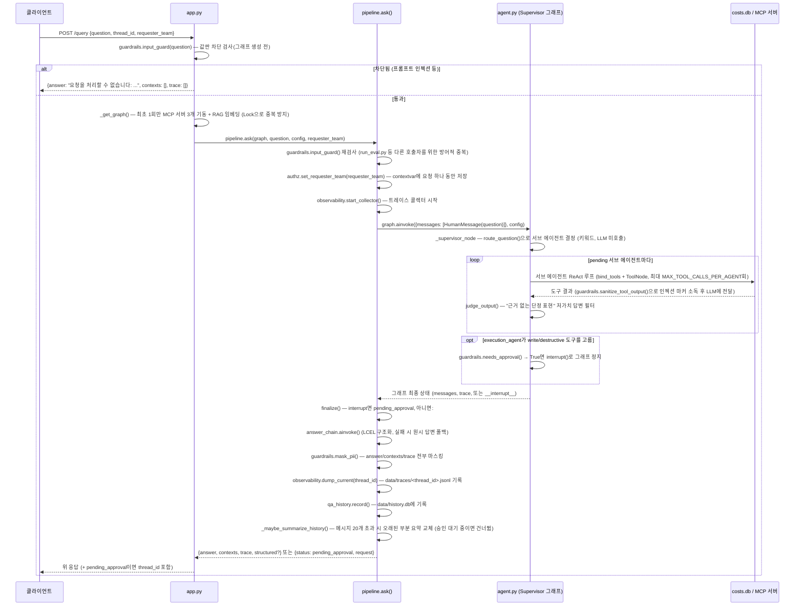
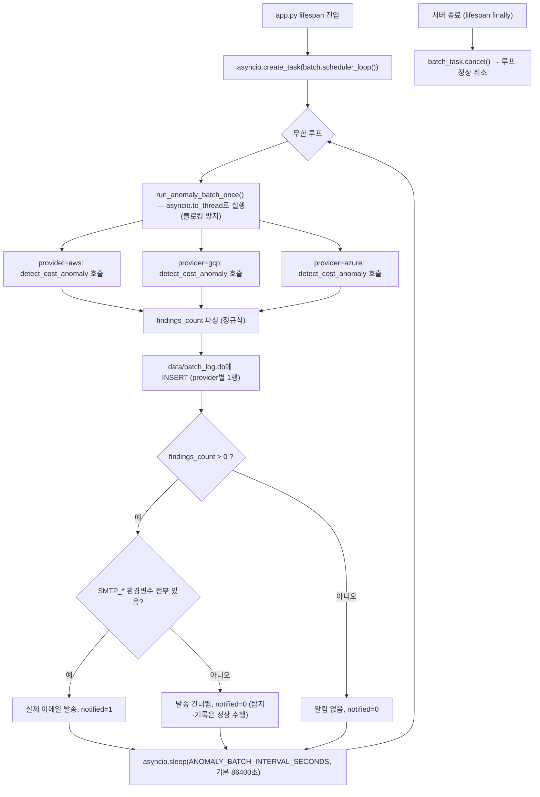
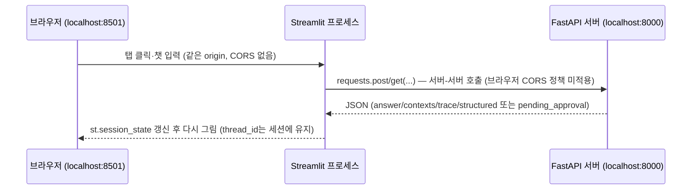

# 프로세스 사양서

이 문서는 이 프로젝트가 실행하는 6개 프로세스를 "트리거 → 입력 → 단계 → 출력 → 예외
처리" 형식으로 정의한다. 아키텍처 개요는 [README.md](README.md), 데이터 구조는
[ERD.md](ERD.md), 서비스 정책은 [SERVICE.md](SERVICE.md)를 참고 — 이 문서는 "코드가
실제로 어떤 순서로 무엇을 하는가"에 집중한다. 아래 시퀀스에 한 줄로만 나오는
`route_question()`/도구 호출 예산/`judge_output()`의 실제 판정 규칙은
[ROUTING_SPEC.md](ROUTING_SPEC.md)에, `input_guard()`/`mask_pii()`/
`sanitize_tool_output()`의 규칙 목록은 [GUARDRAILS.md](GUARDRAILS.md)에 펼쳐뒀다.

| # | 프로세스 | 트리거 | 관련 파일 |
|---|---|---|---|
| 1 | 질의응답 | `POST /query` | `src/app.py`, `src/pipeline.py`, `src/agent.py` |
| 2 | HITL 승인 재개 | `POST /query/approve` | `src/app.py`, `src/pipeline.py`, `src/agent.py` |
| 3 | 이상탐지 배치 | 서버 기동 + 주기 실행 (자동) | `src/batch.py`, `src/app.py` |
| 4 | 합성 데이터 생성/초기화 | 수동 실행 (`python scripts/generate_data.py`) | `scripts/generate_data.py` |
| 5 | 평가셋 자동 채점 | 수동 실행 (`python evaluation/run_eval.py`) | `evaluation/run_eval.py`, `evaluation/eval_lib.py` |
| 6 | 로컬 데모 UI 실행 | 수동 실행 (`streamlit run ui/streamlit_app.py`) | `ui/streamlit_app.py` |

---

## 1. 질의응답 프로세스 (`POST /query`)

### 트리거
클라이언트가 `POST /query`에 `{question, thread_id?, requester_team?}`를 보낼 때.

### 입력
- `question` (필수): 자연어 질의
- `thread_id` (선택): 없으면 서버가 `uuid4()`로 새로 발급 — 같은 값을 재사용하면 멀티턴 대화
- `requester_team` (선택): 자기신고 팀. `None`이면 전체 조회 권한(플랫폼팀), 값이 있으면
  그 팀 범위로 조회가 강제된다 (`authz.py`, [SERVICE.md](SERVICE.md) 가드레일 규칙 5)

### 처리 단계



### 출력
- 정상: `{"answer": str, "contexts": list[{doc_id, text}], "trace": list[{step, input, output}], "structured"?: {...}}`
- 승인 필요: `{"status": "pending_approval", "thread_id": str, "request": {"tool": str, "args": dict, "reason": str}}`
- 차단: `{"answer": "요청을 처리할 수 없습니다: <사유>", "contexts": [], "trace": []}`

### 예외 처리
- `answer_chain` 실패(LLM 오류 등) → 구조화 없이 원시 답변으로 폴백, 요청 자체는 실패시키지 않음
- 서브 에이전트가 `MAX_TOOL_CALLS_PER_AGENT`(기본 4, `optimization_agent`만 7)를 다 쓰면 →
  예산 초과를 명시하는 메시지로 강제 종료 (침묵하지 않음)
- MCP 서버 기동 실패 → 원인을 알 수 있는 `RuntimeError`로 표면화
- `_maybe_summarize_history` 실패(체크포인터 상태 조회 실패 등) → 조용히 건너뜀 (요약은 보강 기능, 필수 경로 아님)

### 대화 기억(메모리) 메커니즘

**문제**: `data/checkpoints.db`가 스레드의 전체 `messages`를 영구 저장하는데도, 서브
에이전트는 원래 "가장 최근 질문 하나"만 프롬프트에 받았다(`_last_human_text()`) — 그래서
"방금 뭐라고 질문했어?" 같은 후속·메타 질문에 답을 못 하고, 심지어 그 질문 자체가
비용/이상탐지 키워드가 없어 라우팅도 안 돼 고정 거절 문구만 나갔다. 체크포인터가 상태를
"들고는 있지만" LLM에 실제로 전달된 적이 없던 것 — 그래서 스레드를 다시 열어도(사이드바
"지난 대화 이어가기") 에이전트가 그 이전 내용을 참고하지 못했다.

**해결 (`src/agent.py`)**:

1. **`_history_before_last_human(messages)`** — 이번 턴 질문(가장 최근 `HumanMessage`)
   앞까지의 대화 전체를 돌려준다. 여기 담기는 메시지는 서브 에이전트가 만든 순수 텍스트
   `AIMessage`("[에이전트명] 답변")뿐이라 `tool_calls`가 안 달려 있어, 원래와 다른
   서브 에이전트에 다시 넣어도 Bedrock의 tool_calls/tool_result 짝 검증에 걸리지 않는다.
   별도 길이 제한이 없는 이유: `pipeline._maybe_summarize_history`가 메시지 20개 초과 시
   오래된 부분을 이미 요약 `SystemMessage` 하나로 교체해두므로, 여기서 그대로 재사용해도
   무한정 커지지 않는다.
2. **`_make_agent_node`/`_execution_decide_node`가 이 히스토리를 실제 프롬프트에 포함**
   — `[SystemMessage(역할 프롬프트), *history, HumanMessage(이번 질문)]` 형태로 서브
   에이전트 LLM 호출에 넘긴다. 지금까지는 `history` 없이 이번 질문만 넘겼다.
3. **`_supervisor_node`의 라우팅 폴백** — `route_question()`이 키워드 매칭에 실패해도
   (`targets == []`), 이미 진행 중이던 대화라면(`human_count > 1`이고 직전 턴에 실제로
   라우팅된 적이 있으면) 그 에이전트에게 그대로 이어서 맡긴다. 대화 맥락이 아예 없는
   첫 턴부터 범위 밖이면 기존처럼 고정 거절 메시지를 낸다(가드레일 성격 유지 — 첫 턴엔
   "이어받을 맥락"이 없으므로).
4. 공통 시스템 프롬프트(`_system_prompt_for`)에 "바로 위 이전 대화를 참고해 답하라"는
   지시를 한 줄 추가.

**실제 재현 검증** (동일 thread_id):
```
[1턴] "이번 달 AWS EC2 비용 총액이 얼마야?"
      -> "...$332.35 USD..."
[2턴] "내가 방금 뭐라고 질문했어?"
      -> "방금 '이번 달 AWS EC2 비용 총액이 얼마야?'라고 질문하셨습니다."
```
수정 전에는 2턴이 "그런 질문은 접수된 적이 없습니다"류로 실패했다.

**한계**:
- 첫 턴부터 비용/이상탐지/최적화/실행 어디에도 안 걸리는 질문은 여전히 거절된다(폴백은
  "이미 라우팅된 적 있음"을 전제로 하므로).
- `execution_agent`가 지금 처리 중인 도구 호출(`pending_tool_calls`)의 승인 과정에는
  히스토리를 안 넣는다(`_execution_approve_node`는 LLM을 아예 호출하지 않는 결정적 노드라
  해당 없음).

---

## 2. HITL 승인 재개 프로세스 (`POST /query/approve`)

### 트리거
1번 프로세스가 `pending_approval`을 반환한 뒤, 클라이언트가 사람 승인 결과를 가지고
`POST /query/approve`를 호출할 때.

### 입력
`{thread_id, approved: bool, requester_team?}` — `thread_id`는 1번 응답에서 받은 값을
그대로 사용. `requester_team`은 **다시 넘겨야 한다** — contextvar는 프로세스 전역이
아니라 요청(태스크)마다 새로 설정되는 값이라 `/query` 때 값이 자동으로 안 이어진다
(`pipeline.resume()` docstring).

### 처리 단계
1. `authz.set_requester_team(requester_team)` 재설정 + `observability.start_collector()`
2. `graph.ainvoke(Command(resume={"approved": approved}), config)` — 멈춰있던 실행 재개
3. `approved=True`면 `execution_agent`가 실제 도구(`stop_resource`/`resize_resource`/
   `send_cost_alert`)를 호출 — 이때도 `authz.check_resource_team()`으로 팀 소유권을
   다시 검사한다(승인됐다고 권한 검사를 건너뛰지 않음)
4. `finalize()` — 1번과 동일 경로(마스킹·트레이스 덤프)
5. `qa_history.record(..., f"[승인 재개: approved={approved}]", ...)`로 기록
6. `approved=False`면 실행하지 않고 거절 사실만 답변에 담음

### 출력
1번과 같은 형식. 도구가 여러 개 승인 대기 중이면(예: 리소스 2개 동시 정지 요청) 한 번의
`approve` 호출이 **하나만** 처리하고, 그래프 엣지가 다음 승인 대기로 자연스럽게 넘어간다
(중복 실행 방지 — `test_hitl_no_duplicate_execution` 회귀 테스트로 검증됨).

### 예외 처리
- 존재하지 않는 `thread_id`로 호출 → 체크포인트가 없어 LangGraph가 에러 (서버 재시작 후에도
  `AsyncSqliteSaver`가 `data/checkpoints.db`에 상태를 남겨두므로 이 케이스는 프로세스 재시작
  자체로는 발생하지 않음)
- `needs_approval()`이 미등록 도구를 만나면 항상 승인 필요로 판정(fail-closed)

---

## 3. 이상탐지 배치 프로세스 (자동 실행, `src/batch.py`)

### 트리거
서버 프로세스(`uvicorn src.app:app`) 기동 시 자동 시작 — 사용자 질의와 무관하게 동작.

### 입력 없음 (자체적으로 전체 provider를 순회)

### 처리 단계



### 출력
- `data/batch_log.db`의 `anomaly_batch_runs`에 provider당 1행 (실행 사이클당 3행)
- `GET /batch-runs?limit=N`으로 조회 가능
- 조건 충족 시 이메일 (제목: `[비용 이상탐지] {PROVIDER} {N}건 발견`, 본문: 도구 원문 출력)

### 예외 처리
- provider 하나가 예외를 던져도 나머지 provider는 계속 진행(`detail`에 `"오류: {exc}"` 기록)
- 루프 자체가 예외로 죽지 않도록 `scheduler_loop()` 전체를 `try/except` + `logger.exception`으로 감쌈
- SMTP 환경변수가 일부만 설정된 경우도 "전부 없음"과 동일하게 취급해 발송 안 함(부분 설정으로 인한 인증 실패 방지)
- **전제**: 이 방식은 서버 프로세스가 상시 실행 중이어야 동작한다. 서버리스처럼 요청이 없으면
  프로세스가 내려가는 배포로 바뀌면 외부 스케줄러(cron 등)가 별도로 필요하다 ([SERVICE.md](SERVICE.md) §5)

---

## 4. 합성 데이터 생성/초기화 프로세스 (`scripts/generate_data.py`)

### 트리거
수동 실행: `python scripts/generate_data.py` (최초 셋업 시 또는 데이터를 리셋하고 싶을 때)

### 처리 단계
1. `SEED=42` 고정 → 이후 모든 난수(`random.uniform`)가 재실행해도 동일한 값 생성
2. `DATA_END_DATE=2026-09-14` 기준으로 90일치 날짜 구간 계산, `TODAY = DATA_END_DATE + 1일`을
   에이전트가 "오늘"로 취급(실제 wall-clock 대신 — `test_queries.csv`의 "어제"/"이번 달" 같은
   상대 표현이 항상 같은 정답을 가리키게 하기 위함)
3. `RESOURCES`(10개, provider당 3~4개) × 90일 → `costs`/`resource_utilization` 행 생성
4. `ANOMALIES` 리스트(2건)에 정의된 (resource_id, date, 배율)만큼 해당 날짜 비용에 배율 적용
   → `detect_cost_anomaly`가 탐지해야 할 정답 케이스
5. `data/raw/costs.csv`, `data/raw/resource_utilization.csv`, `data/raw/anomalies.md`(정답 매핑
   문서) 파일 출력
6. **`data/costs.db`가 이미 있으면 삭제 후 재생성** — `resources`/`costs`/
   `resource_utilization`/`actions_log` 4개 테이블을 새로 만들고 데이터 적재

### 출력
`data/costs.db` (통째로 새로 생성됨), `data/raw/*.csv`, `data/raw/anomalies.md`

### 예외 처리 / 주의
- **파괴적 동작**: 기존 `costs.db`를 무조건 삭제한다(`DB_PATH.unlink()`) — `actions_log`에
  쌓여있던 실행 이력(승인 후 실제 정지/축소 기록)도 이때 같이 사라진다. `history.db`/
  `batch_log.db`는 별도 파일이라 영향 없음(이 분리가 존재하는 핵심 이유)
- 이 스크립트를 안 돌리고 서버부터 띄우면 `tools.py._connect()`가
  `"data/costs.db가 없습니다. 먼저 python scripts/generate_data.py를 실행하세요"` 로 명시적으로 안내

---

## 5. 평가셋 자동 채점 프로세스 (`evaluation/run_eval.py`)

### 트리거
수동 실행: `python evaluation/run_eval.py --round N [--ragas] [--llm-judge]`

### 처리 단계
1. `evaluation/test_queries.csv`(20건) 로드 — `requester_team`/`thread_ref` 필드로 authz·
   멀티턴 시나리오까지 표현
2. 서버를 띄우지 않고 `agent.build_supervisor()` + `pipeline.ask()`를 직접 호출 (그래프
   준비에 MCP 서버 3개 기동 + RAG 임베딩 포함, 수십 초 소요)
3. 문항별로 `answer_fn(item)` 호출 — `thread_ref`가 있으면 이전 문항이 쓴 `thread_id`를
   재사용해 멀티턴 검증
4. `deterministic_judge()` — `expected_tools`(호출 여부)와 `forbidden`(금지어 미포함)을
   결정적으로 판정 (LLM 미호출)
5. `--llm-judge` 옵션 시 `expected_traits`까지 LLM으로 채점 (run-to-run 변동성 있음 — README
   트라이앤에러 회고 참고)
6. `--ragas` 옵션 시 `evaluation/ragas_lite.py`로 faithfulness/answer_relevancy/context_precision 계산
7. `evaluation/round{N}_report.md` 생성, 이전 라운드 결과가 있으면 `compare_eval()`로 회귀 비교

### 출력
`evaluation/round{N}_result.json`(원본 응답), `evaluation/round{N}_report.md`(사람이 읽는 리포트)

### 예외 처리
- Bedrock `ThrottlingException`(일일 토큰 한도) 발생 시 개별 문항은 실패 처리되지만 나머지
  문항은 계속 진행 — 전체가 한 번의 쿼터 문제로 중단되지 않음

---

## 6. 로컬 데모 UI 실행 (`ui/streamlit_app.py`)

### 트리거
수동 실행: `streamlit run ui/streamlit_app.py` — **1번 프로세스(서버)가 먼저 떠 있어야
한다.** 이 UI는 독자적으로 에이전트를 실행하지 않고, 이미 떠 있는 `POST /query` 등을
그대로 호출만 하는 별도 프로세스다.

### 사전 조건
```bash
# 터미널 1 — 서버 (먼저, 계속 띄워둔 채로)
uvicorn src.app:app --reload --port 8000

# 터미널 2 — UI
streamlit run ui/streamlit_app.py
```
브라우저가 자동으로 `http://localhost:8501`을 연다.

### 처리 단계



1. 사이드바에서 서버 주소(`base_url`, 기본 `http://localhost:8000`)와 `requester_team`을 설정
2. "💬 질의응답" 탭에서 입력하면 `st.session_state.thread_id`를 실어 `POST /query` 호출
   — 이 `thread_id`를 세션에 계속 들고 있어야 같은 스레드로 멀티턴이 이어진다
3. 응답이 `pending_approval`이면 "🔒 승인 대기" 탭에 `tool`/`args`/`reason`을 표시하고,
   승인/거절 버튼이 `POST /query/approve`를 호출
4. "🕓 히스토리"/"📊 배치 실행 이력" 탭은 각각 `GET /history`/`GET /batch-runs`를
   버튼 클릭 시 조회해 표로 렌더링

### 출력
브라우저 화면(표/챗/버튼) — 별도로 파일에 기록되는 결과는 없다. 실제 상태 변화는 전부
서버 쪽 DB(`costs.db`/`history.db`/`batch_log.db`/`checkpoints.db`, [ERD.md](ERD.md))에 남는다.

### 예외 처리
- 서버가 안 떠 있으면 화면에 `"서버(...)에 연결할 수 없습니다. uvicorn src.app:app...을 먼저 실행하세요"` 안내
- 그래프 콜드 스타트(MCP 서버 3개 기동 + RAG 임베딩)로 최초 질의는 오래 걸릴 수 있어 요청
  타임아웃을 120초로 넉넉히 잡음 — 그래도 넘으면 타임아웃 안내만 표시하고 앱은 죽지 않음
- **로컬 개발/데모 전용이다** — 인증이 없고 Streamlit 자체가 프로덕션 서빙용이 아니므로
  실제 운영 배포에는 쓰지 않는다
