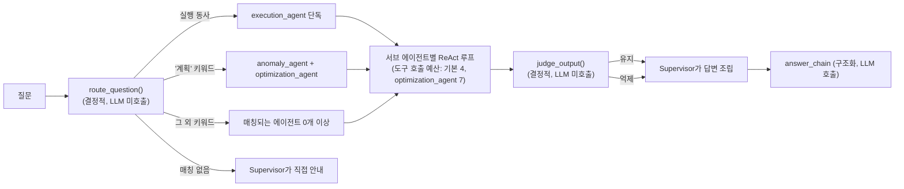

# ROUTING_SPEC · 라우팅·판정 로직 스펙

[agents/*.md](agents/)는 에이전트별로 담당 도구·행동 규칙을 다루지만, `src/agent.py`에는
**여러 에이전트를 가로지르는 공통 결정 로직**이 따로 있다 — 어느 질문을 어느
에이전트에게 보낼지(`route_question`), 서브 에이전트가 도구를 몇 번까지 부를 수
있는지(도구 호출 예산), 그 답변을 사용자에게 그대로 내보낼지(`judge_output`). 셋 다
**LLM을 호출하지 않는 결정적 규칙**이라는 공통점이 있어서 이 문서로 따로 묶었다.
[PROCESS_SPEC.md](PROCESS_SPEC.md) §1의 시퀀스 다이어그램에는 이 셋이 한 줄씩만
등장한다 — 여기서 그 한 줄이 실제로 어떤 규칙인지 펼친다.

## 1. `route_question()` — 서브 에이전트 배분

질문 문자열을 소문자로 바꾼 뒤, 아래 순서로 **처음 걸리는 규칙 하나만** 적용한다(뒤
규칙은 확인하지 않는다).

| 우선순위 | 조건 | 결과 | 왜 이 순서인가 |
|---|---|---|---|
| 1 | `_EXECUTION_PATTERNS` 정규식 중 하나라도 매치 | `["execution_agent"]` 단독 | 조회 요청과 실행 요청이 섞이면 승인 흐름이 애매해진다 — 실행 키워드가 있으면 그것만 본다 |
| 2 | `_PLAN_KEYWORDS`("계획"/"plan") 포함 | `["anomaly_agent", "optimization_agent"]` | Plan-Execute 2단계 분해 — 절감 계획은 이상탐지 결과와 최적화 후보를 함께 봐야 한다 |
| 3 | (그 외) `_AGENT_KEYWORDS` 매칭 | 매칭되는 에이전트 전부(0개 이상) | 비용/이상/최적화 키워드가 하나의 질문에 여러 개 섞일 수 있다(예: "이상 급증이 있었는데 비용도 얼마야?") |

매칭 결과가 빈 목록이면 Supervisor가 직접 안내한다(어느 서브 에이전트도 호출 안 됨).

### 실행 패턴이 정규식인 이유

`_EXECUTION_PATTERNS`는 부분 문자열(`in`) 매칭이 아니라 정규식이다:

```
꺼\s*(줘|주세요|줄래)
(정지|중단|종료|축소|변경)(해|시켜)\s*(줘|주세요|줄래)
발송해
보내\s*(줘|주세요|줄래)
\bstop\b / \bresize\b / \balert\b   (대소문자 무시)
```

"정지해"/"변경해"/"축소해" 같은 어간이 "정지해**야 하나요**?"(문의) ·
"변경해**도 될까요**?"(문의)처럼 명령이 아닌 문장에도 부분 문자열로는 걸려서
`execution_agent`로 오탐 라우팅된 적이 있다(코드 리뷰에서 발견) — "~해/시켜 +
줘/주세요/줄래" 같은 실제 명령형 어미가 뒤에 붙을 때만 실행 요청으로 본다. "꺼"도
"꺼림칙한"/"꺼내서"에 걸리지 않도록 뒤에 줘/주세요/줄래가 와야만 매칭한다.

### 키워드 전체 목록

| 에이전트 | 키워드 |
|---|---|
| `cost_lookup_agent` (`_COST_KEYWORDS`) | 비용, 얼마, 총액, 청구, 요금, cost, spend, billing, 사용률, 가동, 비싸, 비싼 |
| `anomaly_agent` (`_ANOMALY_KEYWORDS`) | 이상, 급증, 급등, 튀었, 이상한, anomaly, spike |
| `optimization_agent` (`_OPTIMIZATION_KEYWORDS`) | 절감, 유휴, idle, savings, reserved, 예약, 다운사이징, downsizing, 최적화, 정책, 한도, 배분, 예산, 조건 |

"예산"/"한도"가 `optimization_agent` 키워드에 있다는 게 중요하다 — "우리 팀 예산 얼마나
썼어?"는 `cost_lookup_agent`가 아니라 `optimization_agent`로만 라우팅된다. 실제로
`get_budget_status` 도구를 처음 `cost_lookup_agent`에 배정했다가, 그 질문을 받는
에이전트는 따로였다는 걸 코드를 다시 보고 발견해 옮긴 적이 있다 — 도구 배정과
라우팅 키워드는 항상 같은 에이전트를 가리켜야 한다.

## 2. 도구 호출 예산

| 상수 | 값 | 대상 |
|---|---|---|
| `MAX_TOOL_CALLS_PER_AGENT` | 4 | 기본값(도구가 1~2개뿐인 에이전트는 충분) |
| `AGENT_MAX_TOOL_CALLS["optimization_agent"]` | 7 | "분기 절감 계획 세워줘" 같은 복합 질문은 유휴 리소스 조회 → `estimate_savings`(후보마다 반복 호출 가능) → `retrieve_docs`까지 필요해서, 기본 예산으로는 계획을 끝까지 못 세우고 중간에 끊겼다(LLM-as-Judge 채점에서 처음 발견) |

예산을 다 쓰면 도구 호출 요청이 텍스트가 아니라서 `judge_output()`이 빈 답변으로 보고
"저가치"로 침묵시켜버리는 문제가 있었다 — 그래서 이 경우엔 `judge_output()`에 넘기기
전에 아래 메시지로 먼저 치환한다:

> "조사 가능한 도구 호출 횟수({max_calls}회)를 다 써서 여기까지만 확인했습니다.
> 질문을 더 구체적으로 나눠서 다시 물어봐 주세요."

## 3. `judge_output()` — 서브 에이전트 산출물 필터

서브 에이전트가 만든 텍스트를 Supervisor에 돌려주기 전에 거르는 마지막 관문이다.
Day 6 취지와 같지만, 이 도메인은 답변이 짧을 수 있어 길이 기준만 완화했다.

| 순서 | 조건 | 판정 |
|---|---|---|
| 1 | 텍스트가 비었거나 10자 미만 | 억제("저가치") |
| 2 | 단정 표현(`_ASSERTIVE_PHRASES`: 확실합니다/틀림없습니다/분명합니다/명백합니다 등)이 있는데, 숫자(`\d`)도 근거 단어(`_SOURCE_WORDS`: 출처/근거/정책/문서/z-score/http/source)도 **둘 다 없음** | 억제("근거 없는 단정") |
| 3 | (그 외) | 유지 |

억제되면 최종 렌더링은 `[{에이전트명}] (억제됨: {사유})` 형태로 남는다 — 답이 통째로
사라지는 게 아니라 "이 에이전트가 뭔가 말했는데 걸러졌다"는 사실 자체가 트레이스에
남는다.

## 4. 전체 흐름



## 관련 문서
- 에이전트별 담당 도구·행동 규칙: [agents/cost_lookup_agent.md](agents/cost_lookup_agent.md), [agents/anomaly_agent.md](agents/anomaly_agent.md), [agents/optimization_agent.md](agents/optimization_agent.md), [agents/execution_agent.md](agents/execution_agent.md)
- 요청-응답 전체 시퀀스: [PROCESS_SPEC.md](PROCESS_SPEC.md) §1
- 입력 차단·출력 마스킹·도구 결과 소독: [GUARDRAILS.md](GUARDRAILS.md)
